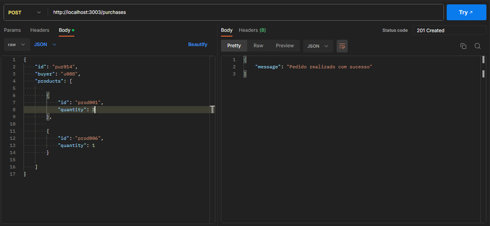

# labecommerce-backend

## Indice
- <a href="#resumo">Resumo</a>
- <a href="#como-rodar-a-api">Como rodar a API<a>
- <a href="#tecnologias-utilizadas">Tecnologias utilizadas<a>
- <a href="#documentação-postman">Documentação Postman</a>
- <a href="#funcionalidades">Funcionalidades da API</a>
  - <a href="#get-all-users">Get all users</a>
  - <a href="#create-user">Create user</a>
  - <a href="#create-product">Create products</a>
  - <a href="#get-all-products">Get all products</a>
  - <a href="#get-products-by-name">Get products by name</a>
  - <a href="#edit-product-by-id">Edit product by ID</a>
  - <a href="#create-purchase">Create purcahse</a>
  - <a href="#delete-purchase-by-id">Delete purchase by id</a>
  - <a href="#get-purchase-by-id">Get purchase by id</a>
- <a href="#pessoas-autoras">Pessoas autoras</a>
- <a href="#contatos">Contatos</a>
## Resumo

API de comunicação com um banco de dados que armazena informações de um e-commerce.
Essa api nos retorna uma lista de usuários, lista de produtos e nos mostra uma compra em específico, nela também podemos cadastrar produtos, novos usuários e criar compras. Além disso, é possível editar um produto e deletar uma compra.


## Como rodar a API
- Comandos
```bach
# Clone este repositório
$ git clone https://github.com/WeslleiBrito/labecommerce-backend.git

# Acesse página do projeto no seu terminal
$ cd labecommerce-backend/

# Instale as dependências
$ npm install

# Execute a apliacação
$ npm run dev
```
## Tecnologias Utilizadas
1. [Node Js](https://nodejs.org/pt-br/docs)
2. [Typescript](https://www.typescriptlang.org/pt/docs/handbook/typescript-in-5-minutes.html)
3. [Express](https://expressjs.com/pt-br/)
4. [Cors](https://developer.mozilla.org/pt-BR/docs/Glossary/CORS)
5. [Sqlite3](https://www.sqlite.org/docs.html)
6. [Knex](https://knexjs.org/guide/query-builder.html)

## Documentação Postman
  #### [Documentação](https://documenter.getpostman.com/view/26586405/2s93sgXr7N)

## Funcionalidades

## Get all users
Retorna todas as pessoas cadastradas.<br>
  *Dados obrigatóros:* 
[get] http://localhost:3000/users


## Create user
- Cadastra uma nova pessoa.<br>
  *Dados obrigatóros:* 
[post] http://localhost:3000/users

 ```typescript
    {
        id: string,
        name: string,
        email: string,
        password: string

    }
 ```

## Create product
Cadastra um novo produto.<br>

*Dados obrigatórios:*
[post] http://localhost:3000/products
```typescript
{
  id: string,
  price: string,
  name: string,
  description: string,
  imageUrl: string
}
```


## Get all products
Retorna todos os produtos cadastrados.<br>
*Dados obrigatórios:*
[get] http://localhost:3000/products<br>


## Get products by name
*Dados obrigatórios:*
[get] http://localhost:3000/products?name

Caso seja enviada uma query params (name) deve ser retornado o resultado da busca de produtos que contenham o "name" informado em seu nome.


## Edit product by id

Edita um produto existente.

*Dados obrigatórios:*
[put] http://localhost:3000/products/:id

*Dados opcionais:*

```typescript
  {
    newId: string,
    name: string,
    price: number,
    description: string,
    imageUrl: string
  }
```


## Create purchase
Cadastra um novo pedido. 

*Dados obrigatórios:*
[post] http://localhost:3000/purchases
```typescript
  {
    id: string,
    buyer: string,
    products: [
      {
        id: string,
        quantity: number
      }
    ]
  }
```


## Delete purchase by id
Deleta um pedido existente.<br>
*Dados obrigatórios:*
[delete] http://localhost:3000/purchases/:id


## Get purchase by id
Retorna os dados de uma compra, incluindo a lista de produtos da mesma.<br>
*Dados obrigatórios:*
[get] http://localhost:3000/purchases/:id<br>


## Pessoas Autoras

```
```
## Contatos
[Linkedin](https://www.linkedin.com/in/wesllei-brito-9222b9202/)